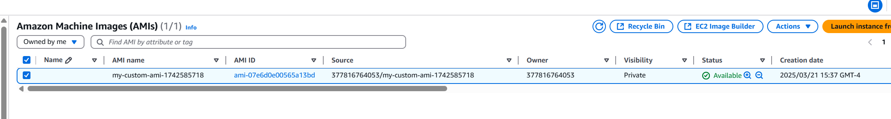
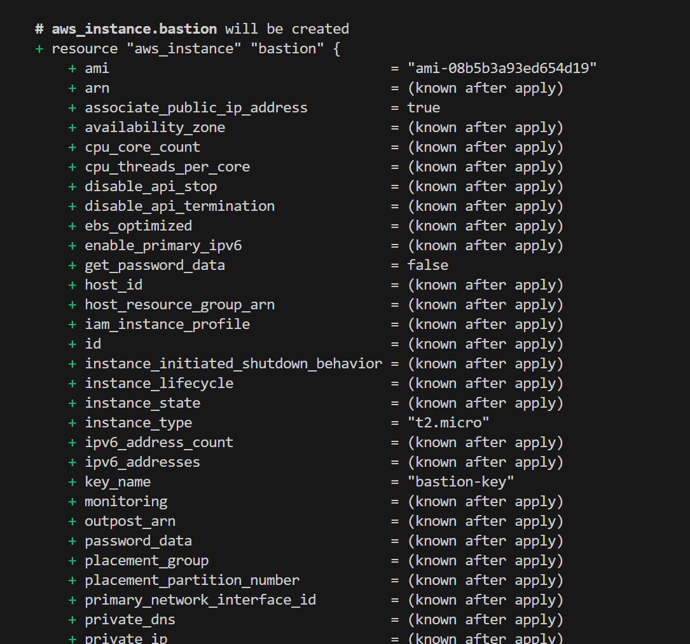
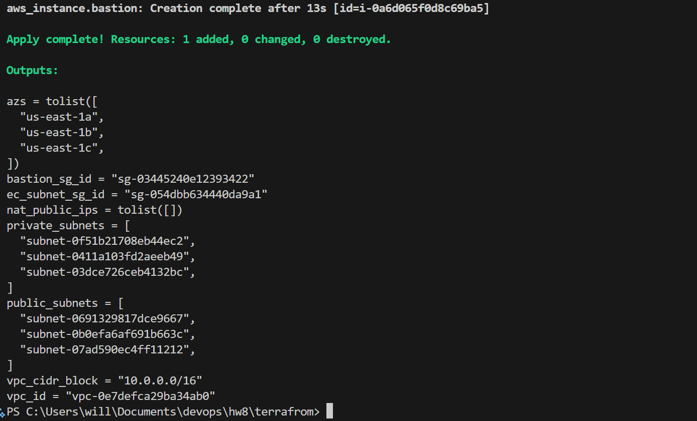
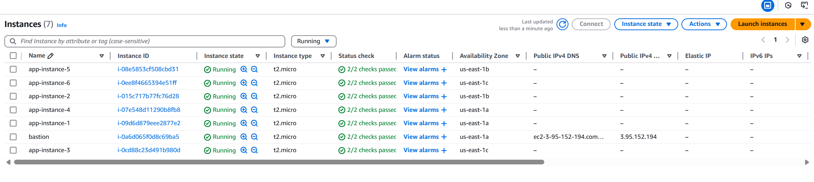
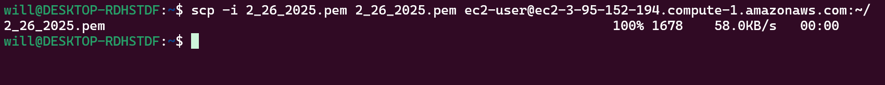
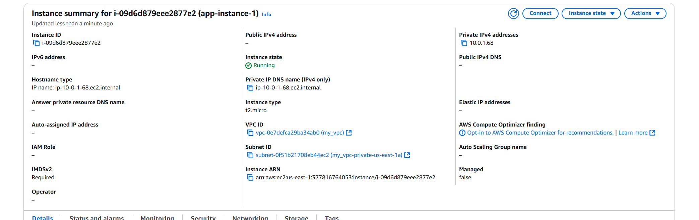
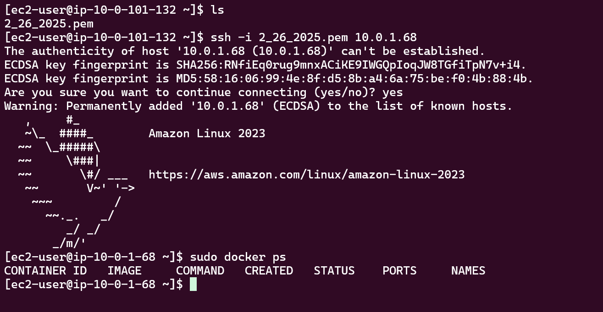

# Packer + Terraform AWS Infrastructure

This project provisions a complete AWS infrastructure using **Packer** and **Terraform**. It demonstrates how to:

- Build a **custom Amazon Machine Image (AMI)** using Packer
- Provision:
  - A **bastion host** in a public subnet (accessible via SSH from your IP only)
  - **6 EC2 instances** in private subnets using the custom AMI
- Control access using **security groups**
- Distribute instances across **multiple Availability Zones (AZs)**

---

## Prerequisites

- AWS CLI configured (`aws configure`)
- Terraform >= 1.0
- Packer >= 1.7
- An existing key pair in AWS or a generated key (`.pem`) file
- Your public IP address for SSH (can be found at https://ipinfo.io/ip)

---

## Step 1: Build a Custom AMI with Packer

Copy your private key under packer folder and replace ssh_keypair_name with public key name and ssh_private_key_file with private key.

```
"ssh_keypair_name": "2/26/2025",
"ssh_private_key_file": "2_26_2025.pem",
```

Navigate to the `packer/` directory and build the image:

```bash
cd packer
packer build ec2-image.json
```

This creates a custom AMI with Docker installed.



## Step 2: Deploy Infrastructure with Terraform

1. Navigate to the Terraform directory:

```
cd ../terraform
```

2. Initialize Terraform:

```
terraform init
```

3. Update variables.tf with:

- Your public IP (e.g. "203.0.113.42/32")

- Your custom AMI ID (from the Packer output)

- Your AWS region (e.g. "us-east-1")

- Your public key in RSA format

- Generate public key using command and copy content

```
ssh-keygen -y -f 2_26_2025.pem > id_rsa.pub
```

4. Plan the configuration:
   It will list out all resources be created

```
terraform plan

```



5. Apply the configuration:

```
terraform apply
```

Desidered Outcome:


## Step 3: Verify Resources Created

A bastion host in a public subnet (with public IP)

6 EC2 instances distributed across 3 private subnets (2 per subnet)

All instances should be running

The private EC2 instances should be accessible via the bastion only



## Step 4: Visit EC2 Instance In Private Subnet

1. Login to bastion host

```
ssh -i yourprivatekey.pem ec2-user@publicIP.compute-1.amazonaws.com
```

2. Transfer private key to bastion host

```
scp -i 2_26_2025.pem 2_26_2025.pem ec2-user@ec2-3-95-152-194.compute-1.amazonaws.com:~/

```



3. Find EC2 instance private ip



4. Login EC2 instance in private subnet

```
ssh -i 2_26_2025.pem 10.0.1.68

```

5. Verify Docker installed
   
