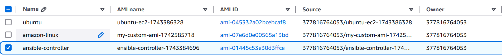
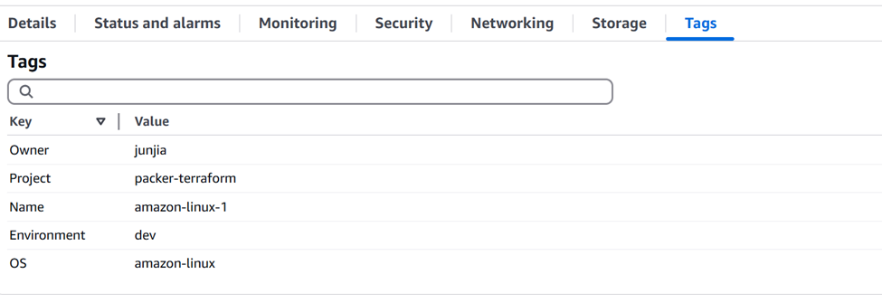
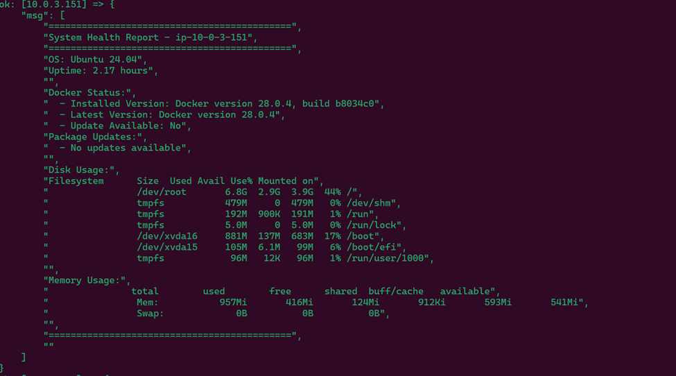
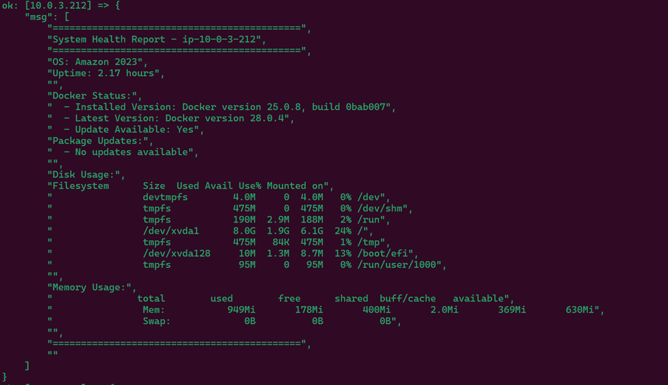
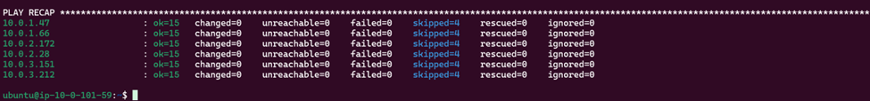

# Multi-OS EC2 Configuration with Ansible

This project involves the use of Terraform, Packer, and Ansible to provision and manage EC2 instances on AWS. The setup provisions six EC2 instances, three running Ubuntu and three running Amazon Linux, alongside a separate EC2 instance to host the Ansible Controller.

Ansible is used in this project to manage the state of the EC2 instances provisioned by Terraform. The Ansible playbook ensures the EC2 instances are configured according to best practices for security and performance, and it automates the routine tasks of updating and upgrading system packages, verifying Docker installation, and monitoring disk usage.

## Prerequisites

- AWS CLI configured (`aws configure`)
- Terraform
- Packer
- Ansible
- An existing key pair in AWS or a generated key (`.pem`) file
- Your public IP address for SSH

---

## Step 1: Build a Custom AMI with Packer

Copy your private key under packer folder and replace ssh_keypair_name with public key name and ssh_private_key_file with private key.

```
"ssh_keypair_name": "2/26/2025",
"ssh_private_key_file": "2_26_2025.pem",
```

Navigate to the `packer/` directory and build the image:

```bash
cd packer
packer build amazon-linux2.json
```

This creates a custom AMI with Docker installed.



Repeate this setp for

```
ensible-controller.json

ubuntu.json

```

## Step 2: Deploy Infrastructure with Terraform

1. Navigate to the Terraform directory:

```
cd ../terraform
```

2. Initialize Terraform:

```
terraform init
```

3. Update variables.tf with:

- Your public IP (e.g. "203.0.113.42/32")

- Your AWS region (e.g. "us-east-1")

- Your public key in RSA format

- Generate public key using command and copy content (only has private key)

```
ssh-keygen -y -f 2_26_2025.pem > id_rsa.pub
```

4. update private-subnet-ec2.tf and ansible-controller.tf

Replace ami created in step1 in resouce

- Ubuntu
- Amazon-Linux
- ansible-controller

5. Plan the configuration:
   It will list out all resources be created

```
terraform plan

```

6. Apply the configuration:

```
terraform apply
```

## Step 3: Verify Resources Created

3 ubuntu 3 amazon-linux 1 bastion host 1 controller

- make sure each EC2 instances has OS tags
  


## Step 4: Transfer prviate key

```
scp -i 2_26_2025.pem 2_26_2025.pem ubuntu@ansible-controller-public-ip.compute-1.amazonaws.com:~
```

We could use AWS security manager but due to leaner's lab limitation we cannot use the advance way.

## Step 5: Config AWS CLI

```
mkdir -p ~/.aws
cd ~/.aws
vim credentials
```

Copy access-key, access-token and session-token in credentials file

## Step 6: Copy private key to .ssh folder

```
mv privatekey.pem  ~/.ssh
chmod 400  privatekey.pem

```


## Step 7: Update static.ini

Replace ips with your private ec2 ips

```
[ubuntu]
10.0.2.172
10.0.3.151
10.0.1.47

[amazon_linux]
10.0.3.212
10.0.1.66
10.0.2.28

[all:vars]
ansible_ssh_private_key_file=~/.ssh/2_26_2025.pem
ansible_ssh_common_args="-o StrictHostKeyChecking=no"
```

## Step 8: Create Ansible Inventory and playbook

Copy all content under an Ansible folder and create a specific file structure

```
root/
   inventory/
   ├── static.ini
   └── group_vars/
      ├── ubuntu.yml
      └── amazon_linux.yml
   playbook.yml
```

When run an Ansible playbook against this inventory, Ansible will:

Use the IP addresses defined under each group to connect to the hosts.

Apply the global variables to all hosts for SSH connections.

Load group-specific variables from group_vars based on the group membership of each host. This means hosts under the [ubuntu] group will use apt to manage packages and have a specific set of Docker packages, while [amazon_linux] hosts will use yum.

## Step 9: Check EC2 configuration

```
ansible-playbook -i inventory/static.ini playbook.yml
```

Ubuntu Report:



Amazon-linx Report:



Play Recap:


